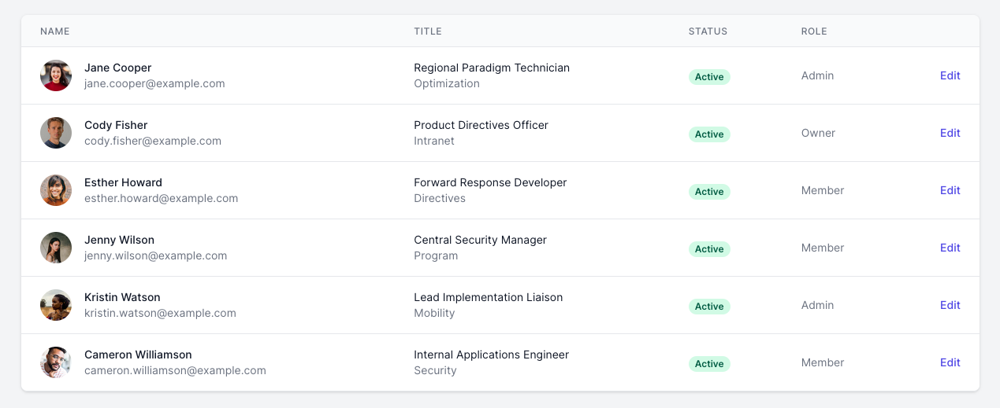
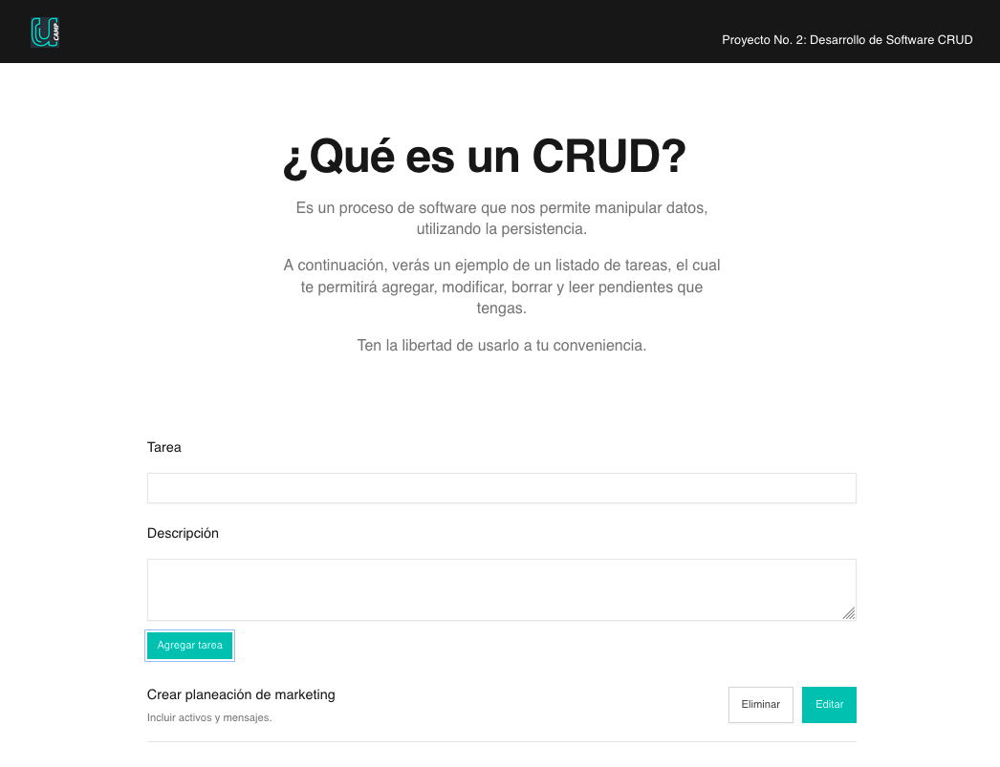

# PROYECTO 2: Aplicación CRUD

## **ÍNDICE**

* [1. Intro](#1-intro)
* [2. Demo](#2-demo)
* [3. ¿Qué construirás?](#3-qu%C3%A9-construir%C3%A1s)
* [4. Objetivos de Aprendizaje](#4-objetivos-de-aprendizaje)
* [5. Requisitos](#5-requisitos-y-entregables)
* [6. Criterios de evaluación](#6-criterios-de-evaluaci%C3%B3n)
* [7. Entregas](#7-entregas)

****

## 1. Intro

Conforme vas aprendiendo, te encontrarás con funciones comunes en el mundo de programación. Entre ellas están los procesos CRUD, operaciones que trabajan con datos para persistirlos en una base de datos. 

Es posible utilizarlos dentro de la interfaz de usuario para facilitar vista, búsqueda y modificación de información.

Se suelen referir al acrónimo:

- C - _Create_ ("Crear")
- R - _Read_ ("Leer")
- U - _Update_ ("Actualizar")
- D - _Delete_ ("Borrar")

Un ejemplo muy común relacionadas con operaciones CRUD son las tablas de datos.

- Se realiza la lectura de los datos alojados y se generan filas donde se incluye el nombre de la persona, su título, su status y su rol.

- Cuenta con un botón "Edit" al final de cada fila que me permite editar el dato.

- Dependiendo de la seguridad, se permite un botón de borrado o agregados nuevos de datos.

Algunos ejemplos donde se aplican las operaciones CRUD son:

- Listado de tareas
- Tablas para gestionar datos
- Sección de comentarios en un blog
- Catálogo de productos

Con estos conceptos hablados, avancemos a desarrollar nuestro segundo proyecto del _bootcamp_.

****

## 2. Demo

Puedes entrar a ver el demo aquí: https://reverent-banach-cb9630.netlify.app/

Observa que se desarrolló una aplicación con operaciones CRUD, puntualmente un listado de tareas. 

Dentro puedes:

- Crear tareas con **AGREGAR TAREA** y los campos de texto especificando la tarea y la descripción.
- Leer las tareas, ubicadas en la parte inferior de la aplicación.
- Actualizar las tareas, con el botón **EDITAR**
- Borrar la tarea, con el botón de **ELIMINAR**

La idea es crear una aplicación similar que cumpla con las 4 operaciones CRUD (crear, leer, actualizar, borrar).

No necesariamente igual o un listado de tareas, pero que sí cumpla con las 4 operaciones CRUD sobre los datos que utilices y se mantenga un nivel mínimo de persistencia.

****

## 3. ¿Qué construirás?

En este proyecto construirás una aplicación que involucre las 4 operaciones CRUD.

A continuación, determinamos las características del proyecto:

- Una aplicación usando solo una página. Puedes utilizar el concepto de _Single Page Application_.
- Una sección en tu aplicación para **crear** elementos (productos, tareas, usuarios, etc.)
- Una sección para **borrar** elementos
- Una sección para **modificar** elementos
- Una sección para ver todos los elementos creados

> Puedes desarrollar una interfaz como esta para cumplir con las 4 operaciones:

****

## 4. Objetivos de aprendizaje

- Aplicar las operaciones CRUD en un segmento de datos.
- Estructurar bajo un paradigma de programación (POO o PF).
- Repasar lo aprendido con CSS, HTML y JavaScript.

****

## 5. Requisitos y entregables

Usa esta lista para saber los requisitos mínimos del proyecto:

### GENERAL

Realizarse de manera individual

### UI 20%
- [ ] Sección `Header`. 5%
- [ ] Footer 5%
- [ ] Responsivo 10.

### JAVASCRIPT 40%
- [ ] Utilizar la estructura de objetos DOM. 20%
- [ ] Persistir los datos y almacenarlos en `window.localStorage`. 20%
    - [ ] Crear / guardar datos dentro localStorage 5%
    - [ ] Recuperar/obtener datos de localStorage 5%
    - [ ] Actualizar los datos de localStorage 5%
    - [ ] Borrar los datos de localStorage 5%

### CONTROL DE VERSIONES 15%
- [ ] Crear un repositorio en GitHub 5%
- [ ] Realizar mínimo 5 "commits" en tu repositorio 10%

### DESPLIEGUE 15%
- [ ] Crear una URL para compartir GitHub Pages 15%

### ENTREGA A TIEMPO 10%
- [ ] Entregar tu proyecto en el tiempo estipulado.

****

## 7. Entregas

- **Definición de fechas.** Habla con tus coaches sobre el periodo de entregas del proyecto.

- **Cumple con los requisitos y entregables.** Debes verificar que cumplas con todo lo que listamos en esta sección y tomes en cuenta el tiempo establecido para ello, ya que de esto depende que obtengas tu insignia.
